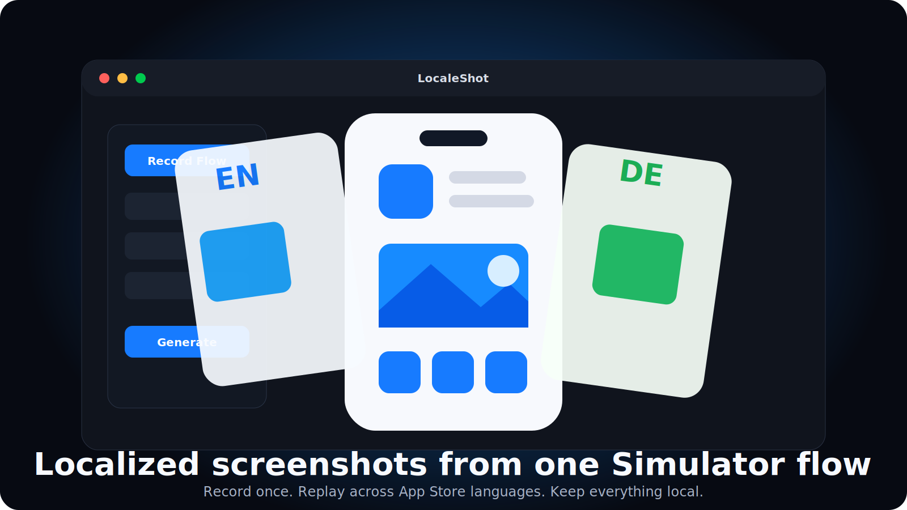

# LocaleShot

  

LocaleShot is a free public beta for indie iOS developers. It records one iOS Simulator screenshot flow and replays it across App Store locales.

This repository is download-only. The source code is private for now.

## Download

Get the latest macOS build from:

https://github.com/Karniej/LocaleShot-Releases/releases/latest

Current beta:

- `LocaleShot-0.1.0-macOS-arm64.zip`
- Apple Silicon only for now
- macOS 13 or newer

## What It Does

- Records taps, drags, typed text, and screenshot checkpoints in the iOS Simulator.
- Replays the same flow across selected App Store languages.
- Saves raw simulator PNG screenshots.
- Keeps projects, generated screenshots, and diagnostics local on your Mac.

LocaleShot does not add device frames, marketing templates, App Store Connect uploads, or AI-driven screen discovery.

## First Run

1. Download and unzip `LocaleShot-0.1.0-macOS-arm64.zip`.
2. Move `LocaleShot.app` to `/Applications`.
3. Open it. If macOS blocks the first launch, right-click `LocaleShot.app` and choose `Open`.
4. Click `Allow` in the Start Here panel and grant Accessibility permission in macOS System Settings.
5. Open your iOS app in Simulator.
6. Click `Attach`.
7. Click `Choose` and select the detected installed app.
8. Click `Languages` and choose App Store locales.
9. Click `Record`, then `Start Recording`.
10. Navigate in the real Simulator window and capture each checkpoint.
11. Click `Generate`.

Generated screenshots are saved in the project output folder and shown in the Review gallery.

## Requirements

- macOS 13 or newer
- Latest stable Xcode
- iOS Simulator runtime installed
- Target app installed in a booted Simulator
- Accessibility permission for recording clicks in the real Simulator window

## Privacy

LocaleShot is local-only. It does not collect telemetry, analytics, accounts, or uploaded screenshots. See [PRIVACY.md](PRIVACY.md).

## License

The released app is free for indie developers during the public beta. Source code remains private. See [LICENSE](LICENSE).

## Source Code

The source code is not public at this stage. Open an issue in this repository for beta feedback, bugs, or feature requests.
